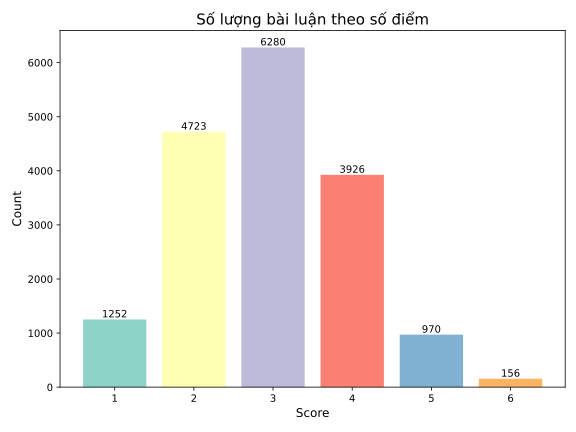
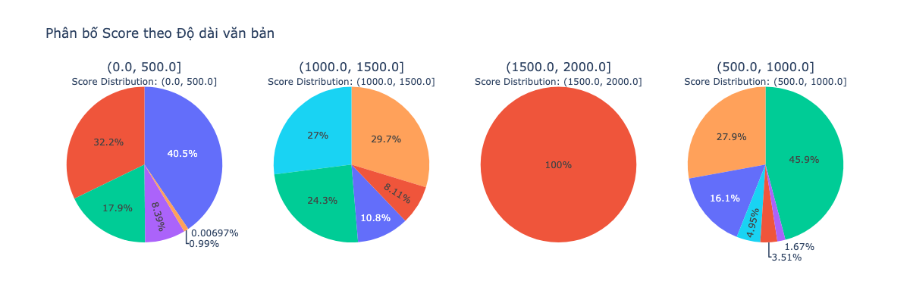
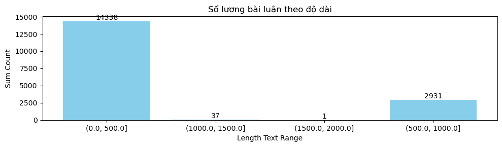
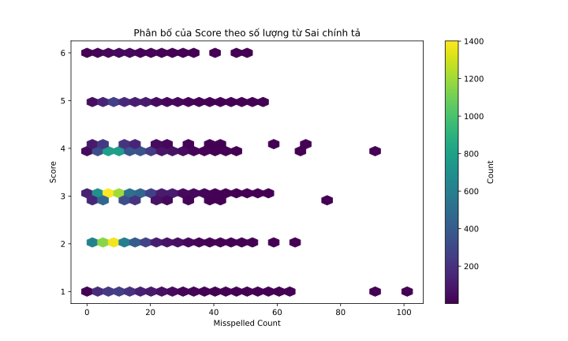
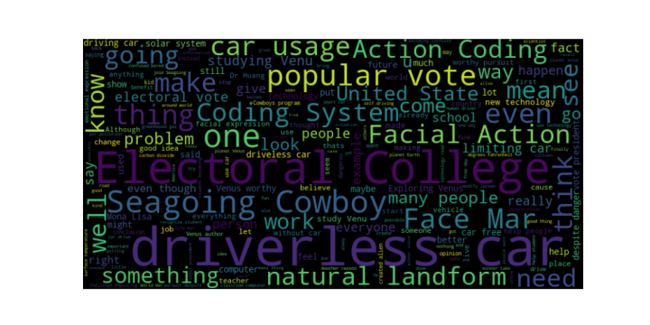
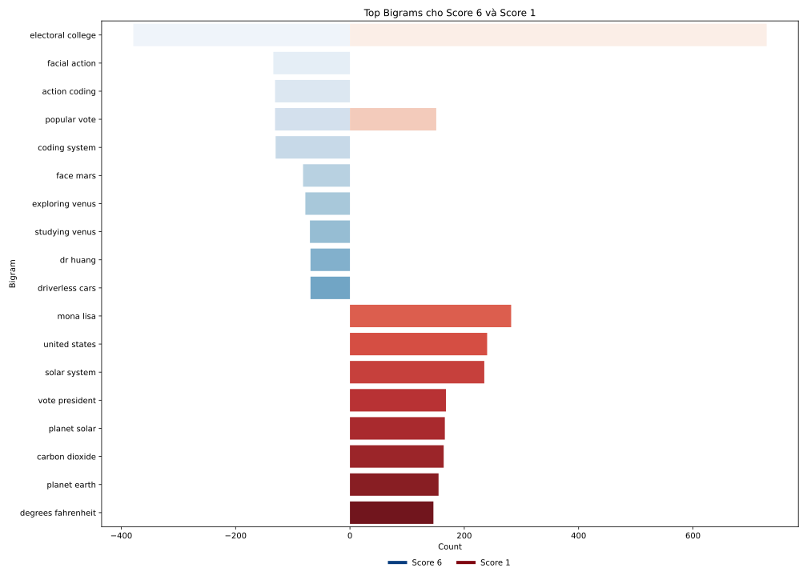
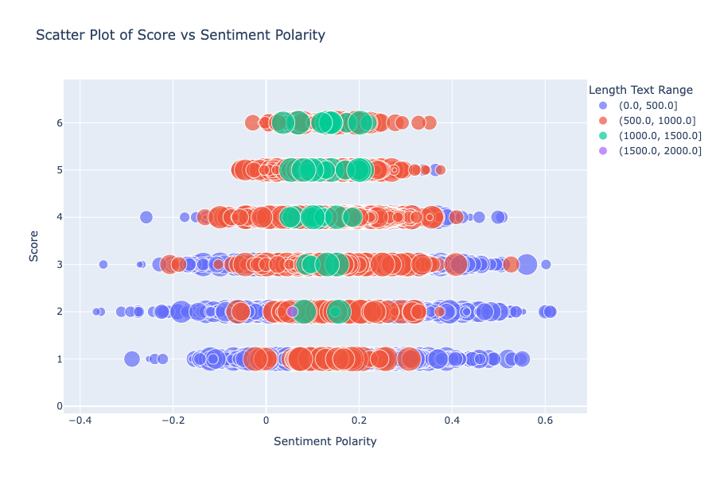
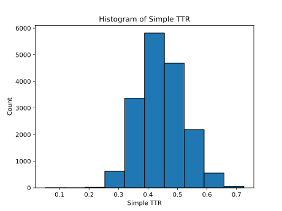

## 1. EDA (Exploratory Data Analysis)
### 1.1 Giới thiệu bộ dữ liệu 
- Dữ liệu được chia ra 2 tập là tập dữ liệu **train** và dữ liệu **test** được tham khảo từ bộ dữ liệu cuộc thi bao gồm khoảng 24000 bài luận, tranh luận do học sinh viết [Đường dẫn đến the Holistic Scoring Rubric](https://storage.googleapis.com/kaggle-forum-message-attachments/2733927/20538/Rubric_%20Holistic%20Essay%20Scoring.pdf). Mỗi bài luận được chấm theo thang điểm từ 1 đến 6. Mục tiêu sẽ là từ bộ dữ liệu train xây dựng mô hình phù hợp để dự đoán số điểm mà một bài luận nhận được từ văn bản của nó (tập test).
### 1.2 Kiểm tra dữ liệu 
#### Kích thước tập dữ liệu 

|        | Train|Test|
|--------|------|----|
| Số dòng|17307 |3   |
| Số cột |  3   |2   |

#### Ý nghĩa của các dòng và cột 
Gồm 3 bộ dữ liệu
- train.csv: Các bài luận và điểm số được sử dụng làm dữ liệu train

| Field     | Description                             |
|-----------|-----------------------------------------|
| `essay_id`  | ID duy nhất của bài luận                  |
| `full_text` | Câu trả lời đầy đủ của bài luận                 |
| `score`   | Điểm tổng thể của bài luận theo thang điểm 1-6 |

- test.csv: Các bài luận được sử dụng làm dữ liệu test. Chứa các trường giống như train.csv, ngoại trừ trường score.

| Field     | Description                             |
|-----------|-----------------------------------------|
| `essay_id`  | ID duy nhất của bài luận              |
| `full_text` | Câu trả lời đầy đủ của bài luận       |    
#### Kiểu dữ liệu mỗi cột 
- Cột `essay_id` và cột `full_text` ở dữ liệu train và text đều có kiểu là **object**.
- Cột `score` ở bộ dữ liệu train là **int**.
#### Kiểm tra missing value  
- Dữ liệu không bị missing.
#### Kiểm tra trùng lắp
- Dữ liệu không bị trùng lắp.
### 2. Phân phối và thống kê dữ liệu 
#### Dữ liệu numerical 
- Cột dữ liệu có dạng numerical là cột `score` ở bộ dữ liệu train.
  - Bảng tóm tắt số liệu thống kê mô tả.
      |      | Score                             |
      |-----------|----------|
      | min | 1          |
      | lower_quartile | 2 |    
      | median | 3   |  
      | upper_quartile | 4  |   
      | max | 6  |    
  - Phân bố các bài luận theo điểm số.
  <figure>
      
      <figcaption style="text-align: center;"><em>Phân bố các bài luận theo điểm số</em></figcaption>
  </figure>

**Nhận xét:**
- Phần lớn bài luận nhận được điểm số 3 (6280 bài), cho thấy đây là mức điểm phổ biến nhất.
Điểm số 2 và 4 cũng có số lượng bài luận khá cao, lần lượt là 4723 và 3926 bài.
- Điểm số 1 và 5 có số lượng bài luận ít hơn đáng kể, lần lượt là 1252 và 970 bài.
Điểm số 6 là mức điểm hiếm gặp nhất với chỉ 156 bài luận, cho thấy rất ít bài đạt được điểm số này.
- Có xu hướng giảm dần số lượng bài luận từ điểm số 3 xuống điểm số 6, cho thấy việc đạt được điểm số cao (5 và 6) là khó khăn hơn so với điểm số thấp hoặc trung bình (1-4).

#### Dữ liệu categorical 
- Do các cột còn lại là các cột mang ý nghĩa định danh và text, nên ta không thu được nhiều ý nghĩa qua cách phân tích trực tiếp .Nhóm sẽ khai thác, khám phá cột `full_text` và mối quan hệ giữa chúng với điểm số qua các câu hỏi phía dưới.
### 3. Các câu hỏi khám phá dữ liệu 
#### Phân bố của điểm số các bài luận theo độ dài

<figure>
      
      <figcaption style="text-align: center;"><em>Phân bố score theo độ dài văn bản</em></figcaption>
 </figure>
<figure>
      
      <figcaption style="text-align: center;"><em>Phân bố score theo độ dài văn bản</em></figcaption>
 </figure>

**Nhận xét chung:**
  - Những bài luận có độ dài càng lớn thì số điểm thấp càng ít.
  - Ở các bài luận (0-500] từ chỉ có 0.00697% được điểm 6 dù số lượng bài luận trong khoảng này rất lớn, trong khi (1000-1500] từ thì chiếm 27% điểm 6.
  - Hầu như các luận trên 1000 từ không có điểm 1.
  - Các luận (500-1000] rất đa dạng điểm, số lượng bài điểm 4, 5 chiếm đa số.
  - Các luận (1000-1500] phân bố điểm khá đều và không có điểm 1 cùng với số lượng khá ít cho thấy chất lượng có thể được đo đạc theo lượng từ trong bài.
=> Có thể thấy phần lớn bài luận có số lượng từ vựng nhiều sẽ có điểm số cao hơn.

  - Tuy nhiên khoảng (1500-2000] từ chỉ có một bài đạt điểm 2 không thể hiện được phán đoán gì. Ta xem thử bài văn này có nội dung như thế nào.

#### Kiểm tra các bài luận có chứa từ vựng sai chính tả, liệu điều này có ảnh hưởng đến điểm số không
<figure>
      
      <figcaption style="text-align: center;"><em>Phân bố số từ vựng sai chính tả</em></figcaption>
</figure>

**Nhận xét:**
  - Số lượng bài luận mắc lỗi từ 0 - 20 từ là nhiều nhất và tập trung ở mức điểm 2 - 4.
  - Hầu như các bài luận được điểm càng cao thì càng mắc ít lỗi chính tả.
  - Các điểm ngoại lai (các bài mắc rất nhiều lỗi - khoảng trên 60 lỗi) có điểm từ 1 - 4.
  - Bài mắc nhiều lỗi nhất (trên 100 lỗi) thường có điểm là 1.
#### WordCloud
<figure>
      
      <figcaption style="text-align: center;"><em>WordCloud</em></figcaption>
 </figure>

**Nhận xét:**
- Có thể thấy chủ đề của các bài luận xoay quanh driverless car, Electoral College, Seagoing Cowboy, Coding System, Face Mar,...
- Ta xem xét bigram của các bài luận có score là 6 và 1 để so sánh.
<figure>
      
      <figcaption style="text-align: center;"><em>Top BiGrams</em></figcaption>
 </figure>

**Nhận xét:**
- Những bigrams được sử dụng ở cả hai mức điểm là electoral college, popular vote và là những từ chủ đề như đã phân tích Wordcloud.
- Hầu như các bigrams nằm trong mức điểm 6 lại rất hiếm khi xuất hiện trong mức điểm 1, có thể vì thế nên các bài luận có score 1 không có tính thống nhất với chủ đề, do đó có số điểm thấp hơn.
#### Phân tích cảm xúc (Sentiment Analysis)
<figure>
      
      <figcaption style="text-align: center;"><em>Sentiment Polarity</em></figcaption>
 </figure>

**Nhận xét:**
- Nếu xét các mức sentiment <0: Thì nhận thấy các bài essay điểm càng cao thì có sentiment càng cao.
- Ngược lại ở các mức sentiment >0: Hầu như các bài essay điểm càng thấp thì có sentiment càng cao.
=> Càng bài essay điểm càng cao có miền sentiment càng thấp.

#### Phân tích độ đa dạng từ vựng
<figure>
      
      <figcaption style="text-align: center;"><em>Histogram chỉ số simple TTR </em></figcaption>
</figure>

**Nhận xét:**
- Đa phần các bài essay có chỉ số đa dạng từ vựng (Simple TTR) phân bố nhiều ở khoảng (0.4-0.5) .Ta hãy cùng xem mối tương quan giữa chúng với điểm số của các bài essay.
<figure>
      
      <figcaption style="text-align: center;"><em>Mối quan hệ chỉ số simple ttr và score</em></figcaption>
</figure>

**Nhận xét:**
- Không có mối quan hệ tỉ lệ thuận giữa điểm số và độ đa dạng từ vựng .Trong trường hợp datasets này có thể có cách chấm điểm không dựa vào độ đa dạng từ hoặc có thể các bài có nhiều từ nhưng tác giả lại sử dụng sai ngữ cảnh dẫn đến điểm có thể sẽ không cao.
- Tuy nhiên để đạt điểm cao (từ điểm 5 trở lên) thì hầu như các bài essay phải có chỉ số `Simple TTR` từ điểm 0.25 trở lên.

## 2. Transformer
Để một mô hình học máy có thể hiểu được ngôn ngữ của con người, từ đó xử lí các thông tin trên dữ liệu văn bản để đưa ra được dự đoán đúng nhất, thì **Transformer** chính là công cụ lí tưởng và tốt nhất cho hầu hết các tác vụ xử lí ngôn ngữ tự nhiên hiện nay, đây cũng chính là công cụ mà OpenAI đã sử dụng và tạo ra ChatGPT - một AI tạo sinh ngôn ngữ được hàng triệu người trên thế giới sử dụng. Sau đây chúng ta sẽ tìm hiểu sơ lược về khái niệm của mô hình Transformer như sau:

### 2.1 Định nghĩa
Transformer là một kiến trúc mạng nơ-ron sâu, được giới thiệu lần đầu tiên trong bài báo "Attention is All You Need" của Vaswani và các cộng sự vào năm 2017. Nó đã trở thành một phương pháp chủ chốt trong lĩnh vực xử lý ngôn ngữ tự nhiên (NLP) và dịch máy tự động, cũng như nhiều ứng dụng khác trong học sâu.

#### Kiến trúc cơ bản của Transformer
Transformer bao gồm hai thành phần chính: **Bộ mã hóa (Encoder)** và **Bộ giải mã (Decoder)**:

**Bộ mã hóa (Encoder):** Encoder nhận dữ liệu đầu vào và xây dựng các đặc trưng (features) của nó. Có nghĩa là mô hình được tối ưu hóa để hiểu biết các thông tin từ đầu vào

**Bộ giải mã (Decoder):** Decoder sử dụng các đặc trưng từ bộ mã hóa cùng với các đầu vào khác để tạo ra một chuỗi đích (target sequence). Điều này có nghĩa là mô hình được tối ưu hóa cho việc tạo ra kết quả.

<figure>
    <p align="center">
    
    </p>
    <figcaption style="text-align: center;"><em>Kiến trúc transformer</em></figcaption>
</figure>

Mỗi phần của mô hình có thể được sử dụng độc lập, tùy thuộc vào nhiệm vụ:
- **Mô hình chỉ mã hóa (Encoder-only models):** Phù hợp cho các nhiệm vụ cần hiểu biết về đầu vào, như phân loại câu và nhận dạng thực thể (Named Entity Recognition - NER).
- **Mô hình chỉ giải mã (Decoder-only models):** Phù hợp cho các tác vụ tạo sinh dữ liệu, như tạo văn bản.
- **Mô hình mã hóa-giải mã (Encoder-decoder models) hoặc mô hình chuỗi-sang-chuỗi (sequence-to-sequence models):** Phù hợp cho các nhiệm vụ tạo sinh dữ liệu nhưng cần nhận dữ liệu đầu vào, như các nhiệm vụ liên quan đến dịch thuật hoặc tóm tắt.

### 2.2 Quy trình hoạt động tổng thể
1. **Mã hóa (Endcoding):**
- Chuỗi đầu vào được đưa qua nhiều lớp mã hóa
- Mỗi lớp mã hóa gồm self-attention và feed-forward network
- Kết quả cuối cùng là chuỗi biểu diễn của đầu vào đã được mã hóa
2. **Giải mã (Decoding):**
- Chuỗi đầu ra từng phần được đưa qua nhiều lớp giải mã
- Mỗi lớp giải mã gồm masked self-attention, encoder-decoder attention và feed-forward network.
- Kết quả cuối cùng là chuỗi đầu ra đã được giải mã hoàn chỉnh.

Bạn có thể tìm hiểu thêm về Transformer tại bài báo "Attention Is All You Need!" <em><a href="https://arxiv.org/pdf/1706.03762" style="text-decoration: none; color: inherit;">[https://arxiv.org/pdf/1706.03762](https://arxiv.org/pdf/1706.03762)</a></em>

### 2.3 Cấu trúc pipeline
Công cụ Pipeline: `pipeline()` là công cụ cơ bản nhất trong thư viện Transformers, kết nối mô hình với các bước tiền xử lý và hậu xử lý cần thiết, cho phép nhập trực tiếp văn bản và nhận câu trả lời có ý nghĩa.
Ta có ví dụ sau:
```python
from transformers import pipeline

classifier = pipeline("sentiment-analysis")
classifier(
    [
        "I've been waiting for a HuggingFace course my whole life.",
        "I hate this so much!",
    ]
)
```

Sau khi thực thi đoạn mã trên ta có kết quả sau:
```python
[{'label': 'POSITIVE', 'score': 0.9598047137260437},
 {'label': 'NEGATIVE', 'score': 0.9994558095932007}]
```
Quy trình này kết hợp ba bước: *tiền xử lý (preprocessing), truyền dữ liệu qua mô hình (model),* và *hậu xử lý (post processing)*.

<figure>
    
    <figcaption style="text-align: center;"><em>Tiến trình pipeline</em></figcaption>
</figure>

Ta sẽ đi qua từng quá trình trên

**Tiền xử lý (Preprocessing):** Bước này bao gồm việc làm sạch và chuẩn hóa dữ liệu, như loại bỏ nhiễu, chuẩn hóa chính tả, và phân tách từ (tokenization). Mục tiêu là chuẩn bị dữ liệu đầu vào để dễ dàng xử lý hơn.
```python
from transformers import AutoTokenizer

checkpoint = "distilbert-base-uncased-finetuned-sst-2-english"
tokenizer = AutoTokenizer.from_pretrained(checkpoint)

raw_inputs = [
    "I've been waiting for a HuggingFace course my whole life.",
    "I hate this so much!",
]
inputs = tokenizer(raw_inputs, padding=True, truncation=True, return_tensors="pt")
print(inputs)
```
*Đoạn code trên thực hiện quá trình xử lí token hóa cho tập dữ liệu đầu vào, với tokenizer từ một mô hình đã được huấn luyện sẵn (pretrained model).*

Kết quả đầu ra lúc này sẽ là:
```python
{
    'input_ids': tensor([
        [  101,  1045,  1005,  2310,  2042,  3403,  2005,  1037, 17662, 12172, 2607,  2026,  2878,  2166,  1012,   102],
        [  101,  1045,  5223,  2023,  2061,  2172,   999,   102,     0,     0,     0,     0,     0,     0,     0,     0]
    ]), 
    'attention_mask': tensor([
        [1, 1, 1, 1, 1, 1, 1, 1, 1, 1, 1, 1, 1, 1, 1, 1],
        [1, 1, 1, 1, 1, 1, 1, 1, 0, 0, 0, 0, 0, 0, 0, 0]
    ])
}
```

Kết quả là một từ điển chứa hai khóa, `input_ids` và `attention_mask`. `input_ids` chứa hai dòng số nguyên (một cho mỗi câu) là các định danh duy nhất của các từ trong mỗi câu, `attention_mask` chỉ ra những token nào được mô hình chú ý đến khi xử lý (giá trị 1 có nghĩa là token đó sẽ được tính toán, còn giá trị 0 có nghĩa là token đó sẽ bị bỏ qua, thường là do nó là padding (đệm) không có ý nghĩa)

**Mô hình hóa (Modeling):** Trong bước này, dữ liệu đã qua tiền xử lý được đưa qua một hoặc nhiều mô hình học máy để rút trích thông tin hoặc tạo ra ngôn ngữ. Các mô hình có thể bao gồm mô hình chỉ mã hóa, chỉ giải mã, hoặc cả mã hóa và giải mã.

```python
from transformers import AutoModelForSequenceClassification

checkpoint = "distilbert-base-uncased-finetuned-sst-2-english"
model = AutoModelForSequenceClassification.from_pretrained(checkpoint)
outputs = model(**inputs)
```
*Cách lấy một mô hình đã được huấn luyện để sử dụng cho dữ liệu đầu vào*

**Hậu xử lý (Postprocessing):** Sau khi mô hình đã xử lý dữ liệu, bước hậu xử lý sẽ chuyển kết quả của mô hình thành dạng cuối cùng mà người dùng có thể hiểu được. Điều này có thể bao gồm việc chuyển đổi kết quả thành văn bản tự nhiên hoặc thực hiện các điều chỉnh cuối cùng trên kết quả.
Sau khi đưa dữ liệu vào mô hình ở trên, ta có dự đoán sau:
```python
print(outputs.logits)
```
```python
tensor([[-1.5607,  1.6123],
        [ 4.1692, -3.3464]], grad_fn=<AddmmBackward>)
```
*Đây là các giá trị *logits* mà mô hình đã dự đoán từ dữ liệu đầu vào, với mỗi vector tương ứng với một chuỗi từ dữ liệu input.*

Vì *logits* chỉ là kết quả thô, chưa được chuẩn hóa, do đó ta phải sử dụng các kĩ thuật khác để đưa nó trở thành kết quả cuối cùng. Trong đoạn code trên, ta sẽ đưa *logits* qua một lớp hàm *Softmax* để phân tích quan điểm (sentiment analysis): 
```python
import torch

predictions = torch.nn.functional.softmax(outputs.logits, dim=-1)
print(predictions)
```
```python
tensor([[4.0195e-02, 9.5980e-01],
        [9.9946e-01, 5.4418e-04]], grad_fn=<SoftmaxBackward>)
```
*Bây giờ chúng ta có thể thấy rằng mô hình đã dự đoán [0.0402, 0.9598] cho câu đầu tiên và [0.9995, 0.0005] cho câu thứ hai. Đó là điểm số xác suất mong muốn.*
Để có được các nhãn tương ứng với mỗi vị trí, chúng ta có thể kiểm tra thuộc tính `id2label` của cấu hình model:
```python
model.config.id2label
```
```python
{0: 'NEGATIVE', 1: 'POSITIVE'}
```
Bây giờ chúng ta có thể kết luận rằng mô hình dự đoán như sau:

Câu đầu tiên: `NEGATIVE`: 0.0402, `POSITIVE`: 0.9598
Câu thứ hai: `NEGATIVE`: 0.9995, `POSITIVE`: 0.0005

**Ứng dụng:** Transformer pipeline đã được áp dụng trong một loạt các nhiệm vụ NLP:
- **Phân loại văn bản:** Phân tích cảm xúc, phân loại chủ đề và phát hiện thư rác được xử lý một cách hiệu quả bởi đường ống phân loại văn bản.
- **Nhận dạng thực thể (NER):** Việc xác định các thực thể như tên, địa điểm, và ngày tháng trong văn bản được đơn giản hóa với đường ống NER.
- **Tạo văn bản:** Việc tạo văn bản mạch lạc và phù hợp với ngữ cảnh có thể truy cập được thông qua quy trình tạo văn bản.
- **Dịch thuật:** Việc dịch văn bản giữa các ngôn ngữ được thực hiện liền mạch bằng quy trình dịch thuật.
- **Trả lời câu hỏi:** Việc trích xuất câu trả lời từ một văn bản nhất định cho một câu hỏi nhất định được thực hiện bằng quy trình trả lời câu hỏi.
### 2.4 Tài liệu tham khảo:
https://huggingface.co/learn/nlp-course/chapter1/3?fw=pt

https://medium.com/@rakeshrajpurohit/exploring-hugging-face-transformer-pipelines-bd432220af0a

https://www.d2l.ai/chapter_attention-mechanisms-and-transformers/transformer.html

https://arxiv.org/pdf/1706.03762
## 3. Fine tuning mô hình DeBERTaV3
### 3.1. Giới thiệu mô hình 
- Mục tiêu của bài toán là từ bài luận của học sinh, dự đoán điểm số từ 1 đến 6. Đây chính là một bài toán encoding điển hình. Các mô hình điển hình trong họ encoding như ALBERT, BERT, DistilBERT, ELECTRA, RoBERTa, ... Trong đó có một mô hình khá nổi trội được sử dụng bởi khá nhiều nhóm tham gia cuộc thi là DeBERTaV3.

- DeBERTa cải thiện các mô hình BERT và RoBERTa bằng cách sử dụng cơ chế tập trung disentangled và bộ giải mã mặt nạ cải tiến. Trong DeBERTa V3, các tác giả đã cải thiện hiệu quả của DeBERTa bằng cách sử dụng tiền huấn luyện kiểu ELECTRA với Chia sẻ Nhúng Gradient-Disentangled. So với DeBERTa, phiên bản V3 của các tác giả cải thiện đáng kể hiệu suất mô hình trên các tác vụ downstream. 

- Một số task quan trọng mà mô trình encoding của transformer cung cấp bao gồm: Fill-Mask, Zere-shot Classification, Named Entity Recognition, Sentiment Analyzing, ... Bản thân DeBERTaV3 được pre-trained để phục vụ tác vụ Fill-Mask nhưng thư viện Transformers đã cung cấp đầy đủ các công cụ để ta có thể fine-tuning mô hình cho các tác vụ classification.

- Cụ thể ta sẽ dùng lênh sau:
```python
AutoModelForSequenceClassification.from_pretrained(cfg.checkpoint,num_labels=1)
```
- Trong đó:
    - `cfg.checkpoint`: checkpoint của mô hình DeBERTaV3 (có thể là local hoặc trên huggingface).
    - `num_labels=1`: Nhóm dự định sẽ để mô hình dự đoán số thực từ 1 đến 6 nên ta sẽ chỉ cần một label.
- Sau khi chạy lệnh này ta sẽ nhận được thông báo 
```
Some weights of DebertaV2ForSequenceClassification were not initialized from the model checkpoint at /kaggle/input/init-aes2/microsoft__deberta-v3-small and are newly initialized: ['classifier.bias', 'classifier.weight', 'pooler.dense.bias', 'pooler.dense.weight'] 
You should probably TRAIN this model on a down-stream task to be able to use it for predictions and inference.
```
- Có nghĩa là ta sẽ không thể tận dụng được các trọng số đã được pre-trained của mô hình nên ta cần phải fine-tuning một mô hình hoàn toàn mới trên tập dữ liệu của mình.

- Mô hình DeBERTaV3 sẽ có 4 phiên bản với độ lớn giảm dần như sau:
    - DeBERTaV3-large: mô hình quá lớn gây ra tràn VRAM nên không thể sử dụng được.
    - DeBERTaV3-base: Mô hình cho kết quả tốt nhất, được nhóm sử dụng để làm bài nộp. Mỗi epoch của mô hình này mất khoảng 30 phút chạy
    - DeBERTaV3-small: Mô hình cho tốc độ chạy nhanh hơn (20 phút/epoch) và kết quả cũng khá tốt nên được nhóm sử dụng chủ yếu để thử nghiệm.
    - DeBERTaV3-xsmall: Mô hình nhỏ nhất, được nhóm sử dụng để khởi đầu.
### 3.2. Tiền xử lý dữ liệu và tokenizer (các hàm preprocessing)
### 3.2.1. Tokenizer của mô hình
- Tokenizer của mô hình sẽ chuyển văn bản thành một dãy các token. Dãy token này sẽ có 3 thành phần để biểu diễn:
    - `input_ids`: Các token đã được mã hóa thành dãy các số nguyên ứng với từ điển của mô hình.
    - `attention_mask`: Một dãy số 0 và 1, 1 ở vị trí token, 0 ở vị trí padding (các token thêm vào để đảm bảo độ dài của dãy token bằng nhau).
    - `token_type_ids`: Dùng để phân biệt các token trong nhiều input khác nhau. Ở bài toán này, chỉ có một input nên giá trị của `token_type_ids` tất cả là 0.
- Để sử dụng tokenizer của mô hình, ta sử dụng `AutoTokenizer` từ `transformers` để load từ checkpoint đã được tải sẵn:
    ```python
    tokenizer = AutoTokenizer.from_pretrained(cfg.checkpoint)
    ```
- Sau khi đã load tokenizer, ta sẽ sử dụng hàm `tokenizer` để mã hóa văn bản thành dãy token:
    ```python
    tokenizer(x['full_text'], truncation = True, max_length = max_length)
    ```
- Trong đó:
    - `x['full_text']`: Văn bản cần mã hóa.
    - `truncation`: Cắt bớt văn bản nếu vượt quá `max_length`.
    - `max_length`: Độ dài tối đa của dãy token.
- Một ví dụ về kết quả trả về của hàm `tokenizer`:
    ```python
    text = "Many people have car where they live."
    ```
    - Sử dụng hàm `tokenizer.tokenize(text)` ta có thể thấy được các token được tạo ra như sau (dấu `▁` ở đầu mỗi token là ký hiệu của một từ):
    ```python
    ['▁Many', '▁people', '▁have', '▁car', '▁where', '▁they', '▁live', '.']
    ```
    - Sử dụng hàm `tokenizer(text, truncation = True, max_length = 20)` ta có thể thấy được kết quả trả về:
    ```python
    {'input_ids': [1, 1304, 355, 286, 640, 399, 306, 685, 260, 2], 
    'token_type_ids': [0, 0, 0, 0, 0, 0, 0, 0, 0, 0], 
    'attention_mask': [1, 1, 1, 1, 1, 1, 1, 1, 1, 1]}
    ```
- Có một vài điểm chú ý:
    - Ở đây chỉ có một input nên max_length sẽ là độ dài của input.
    - Chỉ có 8 token nhưng có 10 phần tử trong `input_ids`, `token_type_ids` và `attention_mask` vì có thêm token `[CLS]` và `[SEP]` ở đầu và cuối dãy token.
    - `token_type_ids` chỉ có giá trị 0 vì chỉ có một input.
    - `attention_mask` chỉ có giá trị 1 vì không có token nào là padding.
### 3.2.2. Tiền xử lý dữ liệu
Trong các bài tiểu luận xuất hiện một vài các lỗi có thể gây ảnh hưởng quá trình tokenization nên cần phải xử lý trước khi mã hóa văn bản thành dãy token. Các lỗi đó bao gồm:
- Xuất hiện chuối `\xa0` (non-breaking space).
- Xuất hiện chuỗi các chuỗi html do web scraping.
- Xuất hiện các dấu chấm liên tiếp.
- Xuất hiện các dấu phẩy liên tiếp.
- Xuất hiện chuỗi `''` thay vì `"`
Ta sẽ sử dụng hàm `preprocessor` để xử lý các lỗi trên
### 3.2.3. Hàm tiền xử lý dữ liệu cuối cùng:
```python
def data_preprocessing(path, tokenizer, max_length):
    data = pd.read_csv(path)
    data['label'] = data['score'].map(lambda x: x - 1)
    data["label"] = data["label"].astype("float32")
    data['full_text'] = data['full_text'].apply(preprocessor)
    dataset = Dataset.from_pandas(data)
    dataset = dataset.map(lambda x: tokenizer(x['full_text'], truncation = True, max_length = max_length), batched = True)
    columns_to_remove = ['essay_id', 'full_text', 'score']
    dataset = dataset.remove_columns(columns_to_remove)
    return dataset
```
- Hàm `data_preprocessing` nhận vào đường dẫn của file dữ liệu, tokenizer và max_length.
- Hàm đọc file dữ liệu, chuẩn hóa cột `score` thành cột `label` để phù hợp với mô hình.
- Loại bỏ các lỗi trong cột `full_text` bằng hàm `preprocessor`.
- Sử dụng đối tượng `Dataset` để lưu trữ dữ liệu.
- Sử dụng hàm `map` để mã hóa văn bản thành dãy token.
    - `truncation = True` để cắt bớt văn bản nếu vượt quá `max_length`.
    - `max_length` là độ dài tối đa của dãy token được định nghĩa là 1024. Vì có khá ít văn bản có độ dài lớn hơn 1024 nên ta sẽ chọn cắt các văn bản dài.
    - `batched = True` để mã hóa dãy token có thể được thực hiện song song trên nhiều văn bản.
- Vì mô hình chỉ cần biết về cấu trúc của dãy token nên ta sẽ loại bỏ các cột không cần thiết còn lại
### 3.3. Các tham số quan trọng

**Mô hình DeBERTaV3**:

- `num_labels`: Số lượng label cần dự đoán.
- `hidden_dropout_prob`: dropout ở lớp ẩn.
- `attention_probs_dropout_prob`: dropout ở lớp attention.

Lý do chọn `hidden_dropout_prob=0` và `attention_probs_dropout_prob=0`: Để tránh batch normalisation gây ra sự không ổn định trong dự đoán của mô hình. Dropout có thể làm giảm tính ổn định của batch normalisation đối với việc dự đoán giá trị liên tục.

**TrainingArguments**:
- `learning_rate`: Hệ số học.
- `warmup_ratio`: Tỷ lệ warmup.
- `num_train_epochs`: Số epoch huấn luyện.
- `per_device_train_batch_size`: Kích thước batch huấn luyện trên mỗi thiết bị.
- `per_device_eval_batch_size`: Kích thước batch đánh giá trên mỗi thiết bị.
- `fp16`: Sử dụng mixed precision training.
- `lr_scheduler_type`: Loại scheduler sử dụng cho hệ số học.
- `weight_decay`: Hệ số weight decay.
- `load_best_model_at_end`: Load mô hình tốt nhất ở cuối quá trình huấn luyện.
- `optim`: Optimiser sử dụng.

**Trainer**:
- `model`: Mô hình cần huấn luyện.
- `args`: Các tham số huấn luyện.
- `train_dataset`: Dữ liệu huấn luyện.
- `eval_dataset`: Dữ liệu đánh giá.
- `data_collator`: Hàm tạo batch từ dữ liệu.
- `tokenizer`: Tokenizer sử dụng để mã hóa dữ liệu.
- `compute_metrics`: Hàm tính toán các metric đánh giá mô hình.

### 3.4. Train mô hình sử dụng StratifiedKFold

Dataset được chia thành 5 folds bằng cách sử dụng `StratifiedKFold` để đảm bảo tỉ lệ các labels trong mỗi fold không thay đổi so với tỉ lệ của toàn bộ dữ liệu. Mỗi mô hình sẽ được huấn luyện trên 4 folds và đánh giá trên fold còn lại. Các mô hình được đánh giá dựa trên `quadratic weighted kappa`. Kết quả dự đoán cuối cùng sẽ là trung bình của các kết quả dự đoán từ 5 mô hình.

**StratifiedKFold**

`StratifiedKFold` là một phương pháp chia dữ liệu thành các folds sao cho tỉ lệ của các labels trong mỗi fold không thay đổi so với tỉ lệ của toàn bộ dữ liệu.

`StratifiedKFold` trả về các splits chứa các chỉ số của dữ liệu trong mỗi fold. Mỗi split chứa 2 mảng chỉ số, một mảng chỉ số cho tập huấn luyện và một mảng chỉ số cho tập kiểm tra tương tự như `KFold`.

Ví dụ: (Nguồn: [3.1. Cross-validation: evaluating estimator performance](https://scikit-learn.org/stable/modules/cross_validation.html#stratified-k-fold))

```python
from sklearn.model_selection import StratifiedKFold, KFold
import numpy as np

X, y = np.ones((50, 1)), np.hstack(([0] * 45, [1] * 5))
skf = StratifiedKFold(n_splits=5)
for train, test in skf.split(X, y):
    print('train -  {}   |   test -  {}'.format(
        np.bincount(y[train]), np.bincount(y[test])))
# Output
# train -  [30  3]   |   test -  [15  2]
# train -  [30  3]   |   test -  [15  2]
# train -  [30  4]   |   test -  [15  1]

kf = KFold(n_splits=3)
for train, test in kf.split(X, y):
    print('train -  {}   |   test -  {}'.format(
        np.bincount(y[train]), np.bincount(y[test])))

# Output:
# train -  [28  5]   |   test -  [17]
# train -  [28  5]   |   test -  [17]
# train -  [34]   |   test -  [11  5]
```

Ta có thể thấy rằng `StratifiedKFold` chia dữ liệu sao cho tỉ lệ của các label trong mỗi fold không thay đổi so với tỉ lệ của toàn bộ dữ liệu. Trong khi đó, `KFold` chia dữ liệu một cách ngẫu nhiên mà không quan tâm đến tỉ lệ của các label.

**Các bước huấn luyện mô hình**

- Gọi hàm `data_preprocessing` lấy dữ liệu đã được tiền xử lý.
- Chia dữ liệu thành 5 fold sử dụng StratifiedKFold.
- Với mỗi fold:
    - Khởi tạo mô hình `DeBERTaV3`.
    - Khởi tạo `TrainingArguments`.
    - Khởi tạo `Trainer`.
    - Huấn luyện mô hình.
    - Đánh giá mô hình.
    - Lưu mô hình.

**Đánh giá mô hình** 

Nguồn: [Learning Agency Lab - Automated Essay Scoring 2.0](https://www.kaggle.com/competitions/learning-agency-lab-automated-essay-scoring-2/overview/evaluation)

Metric dùng để đánh giá mô hình là `quadratic weighted kappa`. `quadratic weighted kappa` là một metric được sử dụng để đánh giá mức độ đồng thuận giữa hai chuỗi số. Metric này thường được sử dụng trong các bài toán dự đoán điểm số, và đề bài trên Kaggle quy định sử dụng metric này.

Metric này được tính như sau. Đầu tiên, một ma trận histogram $O^{N \times N}$ được tạo ra, với $O_{i, j}$ là số lượng mẫu có giá trị thực tế là $i$ và giá trị dự đoán là $j$. Một ma trận trọng số khác $W^{N \times N}$ được tạo ra với:

$$w_{i, j} = \frac{(i - j)^2}{(N - 1)^2}$$

<!-- Một ma trận trọng số kỳ vọng $E$ được tính bằng cách lấy tích của tổng theo hàng và cột của ma trận histogram:

$$E_{i, j} = \frac{O_{i, \cdot} O_{\cdot, j}}{n}$$ -->

Một ma trận trọng số kỳ vọng $E$ được tính bằng cách lấy outer product của histogram thực tế và histogram dự đoán, được chuẩn hóa sao cho tổng của $E$ và $O$ bằng nhau.

Cuối cùng, `quadratic weighted kappa` được tính bằng công thức:

$$\kappa = 1 - \frac{\sum_{i, j} w_{i, j} O_{i, j}}{\sum_{i, j} w_{i, j} E_{i, j}}$$

`quadratic weighted kappa` có giá trị nằm trong khoảng $[0, 1]$, với 1 là giá trị tốt nhất. Kappa càng gần 0 có nghĩa là random agreement, còn kappa càng gần 1 có nghĩa là complete agreement.

Trong bài này nhóm sử dụng hàm `cohen_kappa_score` từ thư viện `sklearn` để tính `quadratic weighted kappa`. Môt ví dụ về cách sử dụng hàm này như sau:

```python
from sklearn.metrics import cohen_kappa_score

y_true = [1, 2, 3, 4, 3]
y_pred = [2, 2, 4, 4, 5]
kappa = cohen_kappa_score(y_true, y_pred, weights='quadratic')
print(kappa)
# Output: 0.6153846153846154
```

### 3.5. Điều chỉnh mô hình về dự đoán regression
Có 2 hướng để có thể sử dụng mô hình DeBERTaV3 để dự đoán 6 điểm số của bài luận.
- Hướng classification: Các điểm số sẽ được mã hóa về các vector sau để đảm bảo tính thứ tự:
    - 1: [1, 0, 0, 0, 0, 0]
    - 2: [1, 1, 0, 0, 0, 0]
    - 3: [1, 1, 1, 0, 0, 0]
    - 4: [1, 1, 1, 1, 0, 0]
    - 5: [1, 1, 1, 1, 1, 0]
    - 6: [1, 1, 1, 1, 1, 1]
- Hướng regression: bởi vì các điểm số này có tính thứ tự tự nhiên (1 < 2 < 3, ...) nên ta có thể dùng bài toán regression để dự đoán.

Sau quá trình thử nghiệm thì nhóm thấy hướng regression cho kết quả tốt hơn nên bài làm sẽ đi theo hướng này.

Để cho mô hình có thể dự đoán regression ta cần một vài điều chỉnh đặt biệt:
```python
model = AutoModelForSequenceClassification. \
                from_pretrained(cfg.checkpoint,
                num_labels=1,
                hidden_dropout_prob = 0,
                attention_probs_dropout_prob = 0,
                cache_dir='./cache')
```
- Đầu tiên ta điều chỉnh `num_labels=1` để mô hình chỉ dự đoán một giá trị điểm số duy nhất (ở đây là số thực)
- Tiếp theo ta sẽ tắt dropout cho mô hình. Dropout là một kỹ thuật regularization được sử dụng để ngăn chặn overfitting trong mạng neural bằng cách ngẫu nhiên "dropout" một phần của các đơn vị (neurons) trong quá trình huấn luyện. Trong trường hợp này, khi sử dụng regression với NLP transformers, việc loại bỏ dropout là cần thiết để tránh batch normalization gây ra sự không ổn định trong dự đoán của mô hình. Điều này là do dropout có thể làm giảm tính ổn định của batch normalization đối với việc dự đoán giá trị liên tục.
## 4. Prompt Engineering với Meta-Llama-3-8B-Instruct
### 4.1. Giới thiệu mô hình
- Mô hình này một mô hình ngôn ngữ lớn với khoảng 8 tỷ tham số. Mô hình thuốc họ Encoder-decoder models, được ra mắt vào ngày  18-04-2024 được sử dụng chủ yếu cho tác vụ Text Generation. 
- Mô hình sẽ được áp dùng vào bài toán bằng cách đưa bài luận và các hướng dẫn chấm điểm vào mô hình, sau đó yêu cầu mô hình sinh ra một đoạn văn bản chấm điểm cho bài luận đó. Bởi vì các mô hình ngôn ngữ lớn như Meta-Llama-3-8B-Instruct đã được huấn luyện trên một lượng lớn dữ liệu nên chúng có khả năng phần nào cảm nhận được gần đúng điểm số của bài luận nhưng vì không được huấn luyện trên tập dữ liệu này nên kết quả trả về sẽ sai lệch khá nhiều.
### 4.2. Các bước thực hiện

**Khởi tạo pipeline**:

Pipeline được khởi tạo với task là `text-generation` và model là `Meta-Llama-3-8B-Instruct`. Tham số `device_map=auto` được sử dụng để tự động chọn thiết bị phù hợp.

Lý do chọn task `text-generation`: Task này phù hợp với bài toán chấm điểm bài luận vì mô hình sẽ sinh ra một đoạn văn bản mới cụ thể là điểm số của bài luận dựa trên đoạn văn bản đã cho.

**Prompt Engineering**

*Input: Đoạn văn cần chấm diểm.*

*Output: Điểm của đoạn văn.*

```python
prompt = [
    {'role': 'system', 'content': "As a teacher, you are going to grade your student's essay."},
    {'role': 'user', 'content': instruction + essay},
    {'role': 'assistant', 'content': f'\n\nThe score is: '}
]
```

Prompt gồm các role với nội dung tương ứng:
- `system`: Cho biết ngữ cảnh và chỉ dẫn ban đầu của prompt.
- `user`: Yêu cầu đặt ra. Ở đây yêu cầu chấm điểm từ 1-6 và kèm theo đoạn văn.
- `assistant`: Phản hồi mà người dùng mong muốn.

Pipeline khi gọi cũng được truyền vào tham số `max_new_tokens=1` để chỉ sinh ra một token mới là điểm số của bài luận. Prompt được đưa vào pipeline để sinh ra điểm số của bài luận sau đó trích xuất điểm số từ đoạn văn và trả về cho hàm.

Với mỗi bài luận, nếu ký tự sinh ra không phải là số thì sẽ gọi lại pipeline với đoạn văn bản đó cho đến khi sinh ra ký tự số hoặc sau 5 lần thử. Nếu vẫn không sinh ra ký tự số thì trả về `None`.

<!-- **Scoring**

*Input: Messages từ bước trên*

*Output: Điểm cho những essay đó*

Messages được đưa vào pipeline, điểm được trích xuất và trả về cho hàm. -->

**Lặp lại quá trình cho cả dataset**

Với mỗi bài luận trong dataset, nhóm sẽ thực hiện các bước trên để sinh ra điểm số cho bài luận đó. Để thuận tiện, có thể dung method `map` của `pandas` để áp dụng hàm cho từng dòng trong dataset.
